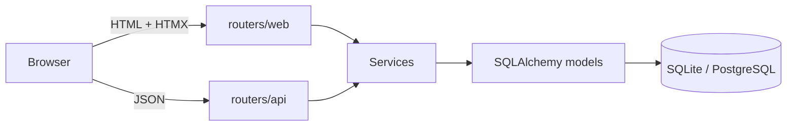

# Controle Financeiro

[](https://github.com/renatogg-dev/controle-financeiro/actions/workflows/ci.yml)


Personal finance tracker — transactions, monthly savings goals, bill reminders — built with FastAPI, SQLAlchemy, and HTMX. Server-rendered UI, no React or Node build step.

<!-- TODO: screenshot of the dashboard -->
<!-- TODO: short GIF of adding a transaction (no page reload) -->

## Tech stack

| Layer | Choice |
|---|---|
| API | FastAPI + Pydantic |
| ORM / migrations | SQLAlchemy 2.0 + Alembic |
| Database | SQLite (default) or PostgreSQL via `DATABASE_URL` |
| Frontend | Jinja2 + HTMX + Tailwind CSS |
| Charts | Chart.js |
| Auth | bcrypt + JWT session cookie + CSRF |
| Tests | pytest + httpx |
| CI | ruff, mypy, GitHub Actions |
| Containers | Docker (multi-stage) + docker-compose |

## Architecture



Routers only handle HTTP (parsing, status codes, serialization). Business logic lives in `services/*.py` as plain, unit-tested functions. Both the HTMX web routes and the JSON API call the same service functions — the API isn't a wrapper around the HTML app, it's documented at `/docs` on its own.

## Quickstart

### Local (SQLite)

```bash
python -m venv venv
source venv/bin/activate  # venv\Scripts\activate on Windows

pip install -e ".[dev]"
cp .env.example .env

alembic upgrade head
uvicorn app.main:app --reload
```

Open http://localhost:8000.

### Docker

```bash
cp .env.example .env   # set a real SECRET_KEY
docker compose up
```

For Postgres instead of SQLite: `docker compose --profile postgres up` and set `DATABASE_URL=postgresql+psycopg://app:app@db:5432/app` in `.env`.

## API docs

Interactive docs generated from the same Pydantic schemas that validate requests:

- Swagger UI: http://localhost:8000/docs
- ReDoc: http://localhost:8000/redoc

## Testing

```bash
pytest --cov=app --cov-report=term-missing   # ~94% coverage
ruff check .
ruff format --check .
mypy app
```

Covers business logic (totals, category breakdowns, goal progress, reminder status), full API routes, cross-user data isolation, and CSRF enforcement. Runs in CI on every push.

## Deployment

Deploy-ready, not deployed. Needs `DATABASE_URL` (managed Postgres), `SECRET_KEY` (`python -c "import secrets; print(secrets.token_hex(32))"`), and `ENV=production`.

## Project structure

```
app/
  main.py                 FastAPI app factory
  config.py                Settings
  database.py               SQLAlchemy engine/session
  models.py                  User, Category, Transaction, Goal, Reminder
  schemas.py                  Pydantic schemas
  security.py                  Password hashing, JWT cookie, CSRF
  deps.py                       Shared FastAPI dependencies
  services/                      Business logic
  routers/
    api/                          JSON REST
    web/                           HTMX HTML routes
  templates/                        Jinja2 templates
  static/                            Compiled CSS, JS
alembic/                              Migrations
tests/
  unit/                                Service-layer tests
  api/                                  Route tests
```

## License

MIT — see [LICENSE](LICENSE).
